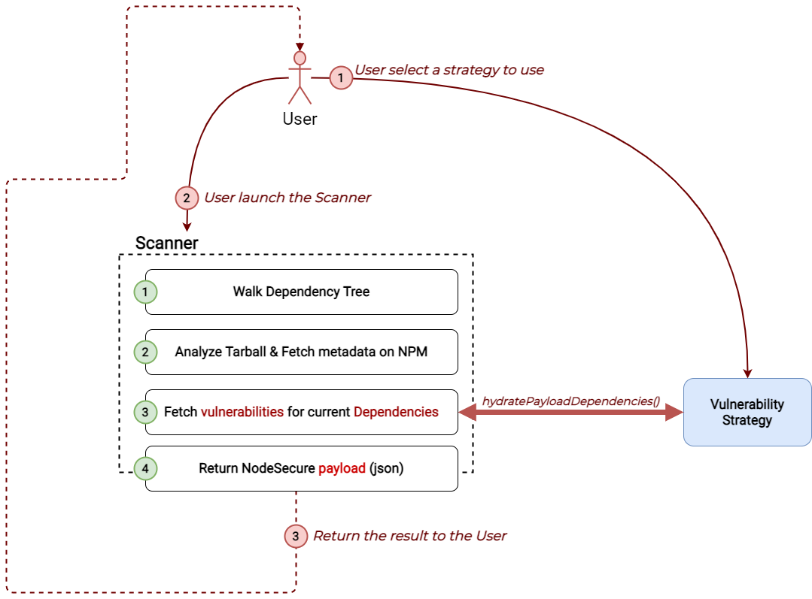

# Adding a new strategy
If you are a contributor and want to add a new strategy to this package then this guide is for you.

The first thing to understand is that this package was built to meet the needs of the [NodeSecure Scanner](https://github.com/NodeSecure/scanner) and NodeSecure CLI.



Dependencies is a `Map` object described in the scanner.

```js
const vulneraStrategy = await vulnera.getStrategy();
vulneraStrategy.hydratePayloadDependencies(payload.dependencies);

payload.vulnerabilityStrategy = vulneraStrategy.strategy;
```

<details><summary>see the complete definition of dependencies</summary>

dependencies is described by the type `Record<string, VersionDescriptor>`. And VersionDescriptor by the following interface:

```ts
interface VersionDescriptor {
    metadata: {
        dependencyCount: number;
        publishedCount: number;
        lastUpdateAt: number;
        lastVersion: number;
        hasChangedAuthor: boolean;
        hasManyPublishers: boolean;
        hasReceivedUpdateInOneYear: boolean;
        author: string | null;
        homepage: string | null;
        maintainers: Maintainer[];
        publishers: Publisher[];
    };
    versions: string[];
    vulnerabilities: Vulnerability[];
    [version: string]: {
        id: number;
        usedBy: Record<string, string>;
        size: number;
        description: string;
        author: string | Author;
        warnings: Warning[];
        composition: {
            extensions: string[];
            files: string[];
            minified: string[];
            required_files: string[];
            required_thirdparty: string[];
            required_nodejs: string[];
            unused: string[];
            missing: string[];
        };
        license: string | License[];
        flags: Flags;
        gitUrl: null | string;
    };
}
```

</details>

## Files to update

The files that must be modified to add a new strategy are:

<details><summary>src/constants.js</summary>

You must add a new constant in variable `VULN_MODE`
```js
export const VULN_MODE = Object.freeze({
  GITHUB_ADVISORY: "github-advisory",
  SNYK: "snyk",
  SONATYPE: "sonatype",
  NONE: "none",
  MY_NEW_STRATEGY: "foobar" // <-- here
});
```

Also think to update the type definition of **VULN_MODE** in `types/api.d.ts`.

</details>

<details><summary>src/index.ts</summary>

This is the file we use to export and manage the initialization of a strategy.
You need to update the initStrategy function and add a new case for your strategy.

```js
export function setStrategy<T extends Kind>(
  name: T
): AllStrategy[T] {
  if (name === VULN_MODE.GITHUB_ADVISORY) {
    localVulnerabilityStrategy = Object.seal(GitHubAdvisoryStrategy());
  }
  else if (name === VULN_MODE.MY_NEW_STRATEGY) { // Add condition here
    localVulnerabilityStrategy = Object.seal(FooBarStrategy());
  }
  else {
    localVulnerabilityStrategy = Object.seal(NoneStrategy());
  }

  return localVulnerabilityStrategy as AllStrategy[T];
}
```

</details>

<details><summary>README.md</summary>

It is obviously necessary to add your strategy in the README. Also make sure that the codes and definitions are up to date.

</details>

---

You will obviously need to add your own `.ts` file in the **src/strategies** folder. The content at the start will probably look like this:

```ts
// Import Internal Dependencies
import { VULN_MODE } from "../constants.ts";
import type { Dependencies } from "./types/scanner.ts";
import type {
  HydratePayloadDepsOptions,
  BaseStrategy
} from "./types/api.ts";

export type FooBarStrategyDefinition = BaseStrategy<"foobar">;

export function FooBarStrategy(): FooBarStrategyDefinition {
  return {
    strategy: VULN_MODE.MY_NEW_STRATEGY,
    hydratePayloadDependencies
  };
}

export async function hydratePayloadDependencies(
  dependencies: Dependencies,
  options: HydratePayloadDepsOptions = {}
) {
  // Do your code here!
}
```

---
> [!WARNING] 
> Documentation and testing are not specified here because it is difficult to predict what is needed. However, you are also responsible for adding them.

Take an interest in the previous works in `docs/` and `tests/strategies`. 
